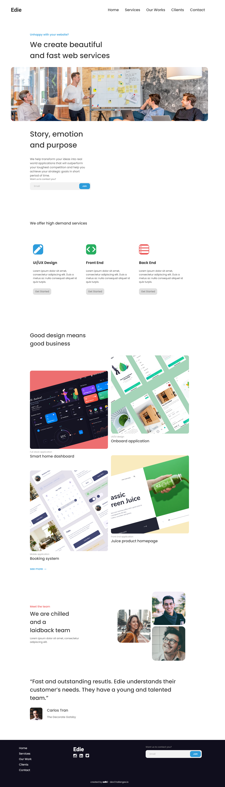
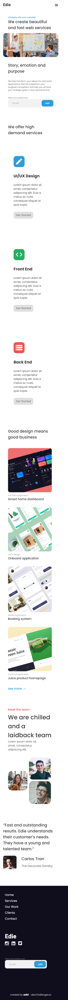

<h1 align="center">Homepage Challenge</h1>

   Solution for a challenge from  <a href="http://devchallenges.io" target="_blank">Devchallenges.io</a>.

  <h3>
    <a href="https://app.netlify.com/sites/homepage-adhi/settings/general">
      Demo
    </a>
     | 
    <a href="https://github.com/AdhipathiPandiyan-S/Homepage-Devchallenges">
      Solution
    </a>
     | 
    <a href="https://devchallenges.io/challenges/xobQBuf8zWWmiYMIAZe0">
      Challenge
    </a>
  </h3>

## Table of Contents

- [Overview](#overview)
  - [Built With](#built-with)

## Overview

### Built With

- Html
- Css
- Js
